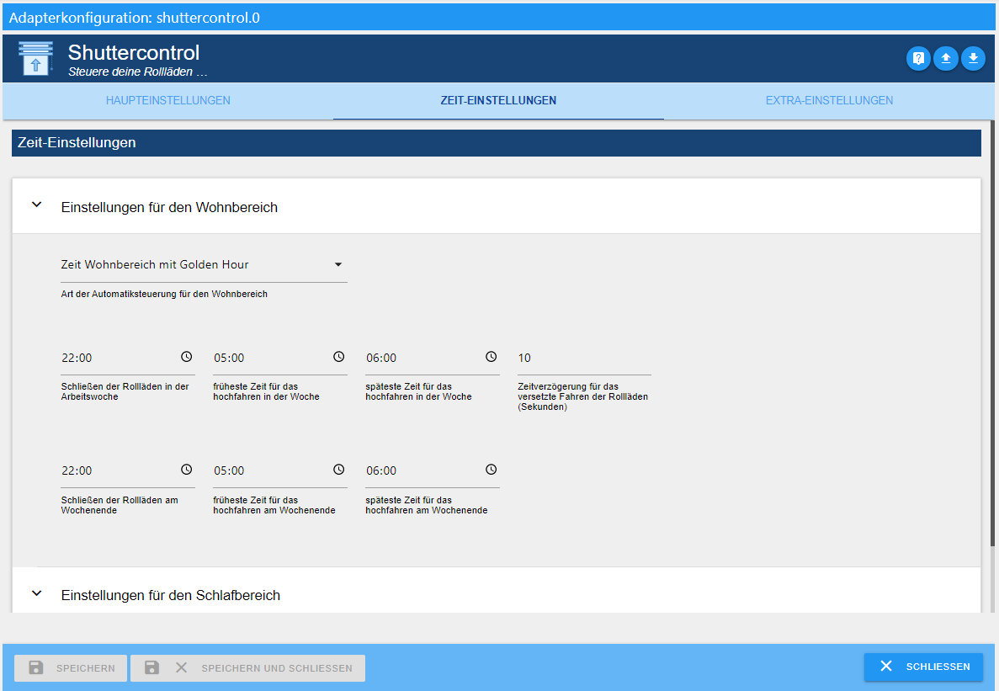
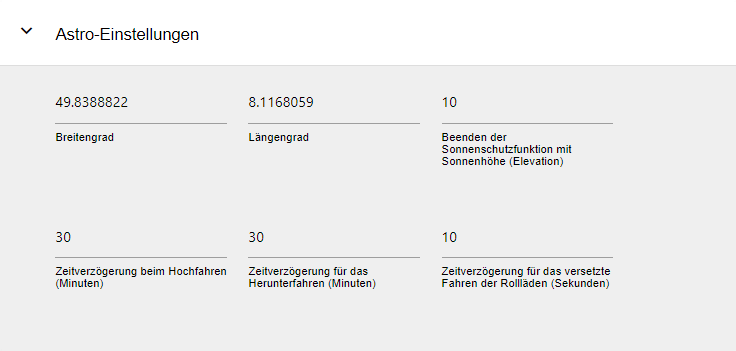
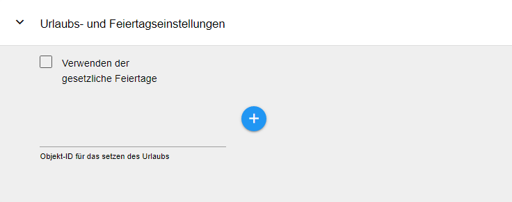
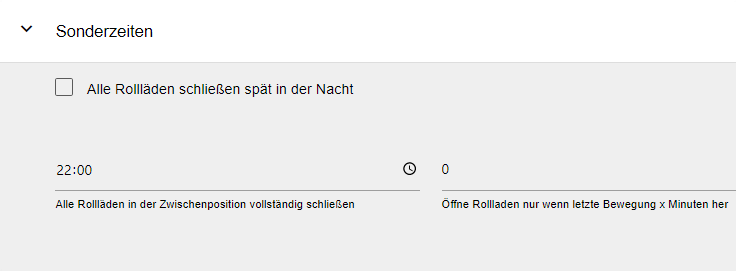
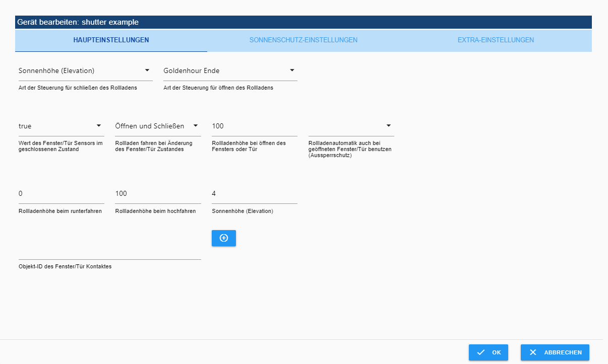
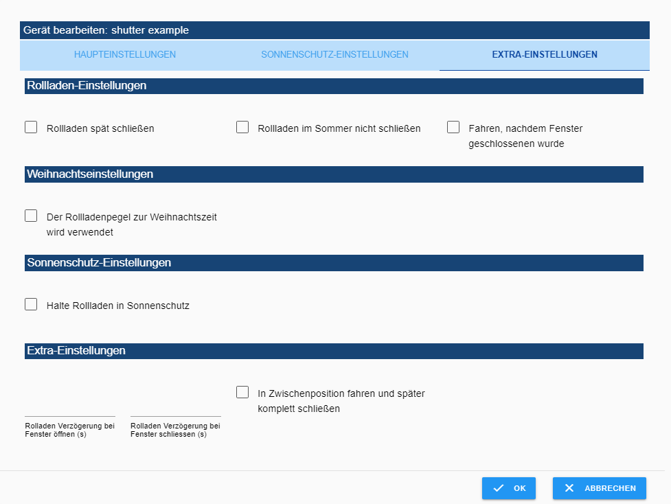

# Shuttercontrol - Adapter zur automatischen Rollladensteuerung

 

[](https://www.npmjs.com/package/iobroker.shuttercontrol)
[](https://www.npmjs.com/package/iobroker.shuttercontrol)
[](https://snyk.io/test/github/simatec/ioBroker.shuttercontrol)

[](https://travis-ci.org/simatec/ioBroker.shuttercontrol)

[](https://github.com/simatec/ioBroker.shuttercontrol/blob/master/LICENSE)
[](https://paypal.me/mk1676)


**If you like it, please consider a donation:**
  
[](https://www.paypal.com/cgi-bin/webscr?cmd=_s-xclick&hosted_button_id=Q4EEXQ6U96ZTQ&source=url)

# Inhalt
* [Grundlegendes](#grundlegendes)
* [Installation](#installation)
* [Adapterkonfiguration - HAUPTEINSTELLUNGEN](#adapterkonfiguration---haupteinstellungen)
* [Adapterkonfiguration - ZEIT-EINSTELLUNGEN](#adapterkonfiguration---zeit-einstellungen)
* [Adapterkonfiguration - EXTRA-EINSTELLUNGEN](#adapterkonfiguration---extra-einstellungen)
	* [Astro-Einstellungen](#astro-einstellungen)
	* [Sommer-Einstellungen](#sommer-einstellungen)
	* [Weihnachtseinstellungen](#weihnachtseinstellungen)
	* [Urlaubs- und Feiertagseinstellungen](#urlaubs--und-feiertagseinstellungen)
	* [Sonderzeiten](#sonderzeiten)
	* [Extra-Einstellungen](#extra-einstellungen)
* [Individuelle Rollladeneinstellungen](#individuelle-rollladeneinstellungen)
	* [Haupteinstellungen](#haupteinstellungen)
	* [Sonnenschutz-Einstellungen](#sonnenschutz-einstellungen)
	* [Extra-Einstellungen](#extra-einstellungen-rollladen)
* [Datenpunkte](#datenpunkte)
	* [shuttercontrol.0.control](#shuttercontrol.0.control)
	* [shuttercontrol.0.info](#shuttercontrol.0.info)
	* [shuttercontrol.0.shutters](#shuttercontrol.0.shutters)

## Grundlegendes

> Die Anleitung ist gültig für Version 1.3.x

Shuttercontrol ist ein Adapter für eine sehr umfangreiche Steuerung von Rollläden,
Jalousien oder Markisen und umfasst sowohl die automatische Beschattung als auch
die nächtliche Verdunklung.

> Der Einfachheit halber wird hier nur von Rollläden gesprochen.

Für die Steuerung stehen sehr viele einstellbare Parameter zur Verfügung, z.Bsp.:
* zwei verschiedene globale Timer (z.B. unterschiedlich für Schlaf- und Wohnräume),
* diverse Sonnenstands abhängige Parameter die individuell je Rollladen eingestellt
werden können,
* Trigger für Tür-/Fenstersensoren die einem Aussperrschutz dienen oder ein automatisches
Öffnen zu einem individuellen Level bei Öffnen der Tür oder des Fensters dienen,
* verschiedene einstellbare Parameter für Beschattung in Abhängigkeit von z.B.
Innentemperatur, Außentemperatur, Helligkeit, Hitzesensor o.ä.,
* Einbeziehung des Sonnenstands um nur Räume zu verdunkeln, die tatsächlich beschienen
werden.

Alle Konfigurationsdatenpunkte sind bereits mit Beispielen voreingestellt, so dass
der Adapter nach Installation und Eingabe von den IDs der Rollladen Aktoren schnell
betriebsbereit ist.

Die weitere Konfiguration dient dann der Anpassung an persönliche Wünsche.

> Shuttercontrol kann Aktoren nur über die Position wie z.B. LEVEL mit Werten
von 0 bis 100 respektive 0-255 steuern. Das jeweilige Rollladen- oder Jalousietiming muss vom Aktor übernommen werden. Jalousie Aktoren, welche je ein Objekt für "Höhe" und "Lamellenwinkel" anbieten, können unter Verwendung von zwei Rollladenobjekten mit gleicher Parametrierung verwendet werden.

> Achtung: Wenn der Shuttercontrol Adapter neu gestartet wird (Auch nach Konfigurationsänderungen) müssen die Rollläden mittels des Button "obenAll" (shuttercontrol.0.control.openAll) hochgefahren werden. Auch wenn diese schon offen sind! (Initialisierungsfahrt) Dies initialisiert alle Adapter internen Werte.


## Installation
Eine Instanz des Shuttercontrol-Adapters wird über die ioBroker Admin-Oberfläche
mit klicken auf das + Zeichen installiert. Je nach eingestellten aktiven Verwahrungsort
im Admin Adapter wird die stable(default) oder latest Version  installiert.


Nach der Erstellung der Instanz öffnet sich automatisch das Konfigurationsfenster
mit den Haupteinstellungen:

## Adapterkonfiguration - HAUPTEINSTELLUNGEN


* **1:** hinzufügen eines Rollladen Aktors

* **2:** Ändern eine ausgewählten Rollladen Aktors

* **3:** individuelle Konfiguration des jeweiligen Rollladens öffnen

* **4:** Rollladen kopieren 

* **5:** Festlegung der Reihenfolge in der die Rollläden mit gleichen Einstellungen fahren.

* **6:** Löschen des Rollladen Aktors mit allen konfigurierten Daten!

* **Nr:**  fortlaufende Nummer der gelisteten Rollläden

* **Aktiv:** Checkbox zur Aktivierung/Deaktivierung der Steuerung des entsprechenden Rollladens

* **Name:** Name des Aktors wird bei der Auswahl der ID automatisch aus den Objekten eingelesen
und kann danach nach eigenen Wünschen abgeändert werden.

* **Objekt-ID Rollladen:** Eindeutige ID des zu steuernden Datenpunkts in den Objekten

* **7:** Aufruf der Adapter Github Seite

* **8, 9:** Konfigurationsdatei laden bzw. speichern


Der Beispiel Aktor *shutter example* wird automatisch angelegt. Diesen bitte löschen
und anschließend durch Anklicken des mit 1 markierten (+) die eigenen Rollladen Aktoren
hinzufügen.


Nach Abschluss der ID-Auswahl ist der Adapter bereits betriebsbereit und wird nun
weiter an die eigenen Wünsche angepasst.

---
Bevor nun [individuelle Rollladeneinstellungen](#individuelle-rollladeneinstellungen) bei jedem Rollladen durchgeführt werden,
sollten die grundlegenden [Zeit-Einstellungen](#adapterkonfiguration---zeit-einstellungen) und [Extra-Einstellungen](#adapterkonfiguration---extra-einstellungen) erfolgen:

---

## Adapterkonfiguration - ZEIT-EINSTELLUNGEN
Hier werden grundlegende Zeit- bzw. Astro Einstellungen vorgenommen, die später in
den [individuellen Rollladeneinstellungen](#individuelle-rollladeneinstellungen) für jeden Rollladen ausgewählt werden.

> Hinweis:  
Das Schließen von Rollläden am Freitag erfolgt zur eingestellten Wochenendzeit
und am Sonntag zur eingestellten Arbeitswochenzeit!




### Einstellungen für den Wohnbereich, Schlafbereich und Kinderbereich
Über Dropdown werden die einzelnen Einstellungen geöffnet.
Die Beschreibung ist exemplarisch für den Wohnbereich beschrieben und gilt analog
für alle Bereiche.

> Hinweis:  
Natürlich muss diese Kategorisierung nicht zwingend für einen Wohn-, Schlaf- oder
Kinderbereich genutzt werden, sondern ermöglicht drei Bereiche im Gebäude
mit unterschiedlichen Fahrzeiten der Rollläden zu definieren.

**Art der Automatiksteuerung für den Wohnbereich**, über Pulldown wird gewählt zwischen:

* **Nur die Zeit Wohnbereich:**  
Die Rollläden werden ausschließlich zeitgesteuert gefahren
* **Zeit Wohnbereich mit Sonnenauf- & Sonnenuntergang:**  
Die Rollläden werden nach Sonnenauf- und Sonnenuntergang gesteuert, jedoch fahren nicht
vor der frühesten Zeit hoch und nicht nach der spätesten Zeit herunter.
* **Zeit Wohnbereich mit GoldenHour:**  
Analog zu dem Sonnenauf- und Sonnenuntergang, jedoch mit dem Beginn und Ende der "Golden Hour" als Referenz

**Schließen der Rollläden in der Arbeitswoche:**  
Übliche Zeit für die Verdunklung während der Woche

**früheste Zeit für das hochfahren in der Woche:**  
zu dieser Zeit fahren die Rollläden in der Woche *frühestens* hoch

**späteste Zeit für das hochfahren in der Woche:**  
zu dieser Zeit fahren die Rollläden in der Woche *spätestens* hoch

**Zeitverzögerung für das versetzte Fahren der Rollläden (Sekunden):**  
Abstand zwischen den einzelnen Rollladenfahrten dieses Bereichs um z.Bsp.
Funkstörungen zu vermeiden, oder den Anschein zu erwecken, sie würden manuell gefahren.

**Schließen der Rollläden am Wochenende:**  
Übliche Zeit für die Verdunklung am Wochenende **und** an Feiertagen

**früheste Zeit für das hochfahren am Wochenende:**  
zu dieser Zeit fahren die Rollläden am Wochenende **und** an Feiertagen *frühestens* hoch

**späteste Zeit für das hochfahren am Wochenende:**  
zu dieser Zeit fahren die Rollläden am Wochenende **und** an Feiertagen *spätestens* hoch

> Soll der Rollladen niemals hochfahren, wenn die Sonne noch nicht einen
> bestimmten Stand überschritten hat, muss diese Zeit auf den spätesten
> Zeitpunkt dieses Sonnenstandes (am 21.12.) eingestellt werden.


## Adapterkonfiguration - EXTRA-EINSTELLUNGEN

### Astro-Einstellungen



**Breiten- und Längengrad:**  
Breiten- und Längengrad übernimmt Shuttercontrol aus den ioBroker Systemeinstellungen.
Shuttercontrol berechnet anhand dieser Werte den Sonnenstand.

**Beenden der Sonnenschutzfunktion mit Sonnenhöhe (Elevation):**  
Sobald die Sonne die hier eingestellte Höhe *unterschreitet*, endet die Beschattung
durch Shuttercontrol.
> Evtl. vorhandene vorzeitige Beschattung durch Bebauung oder hohe Bäume kann
> hiermit berücksichtigt werden und die Beschattungsautomatik früher beenden.

**Zeitverzögerung beim Hochfahren bzw. für das Herunterfahren (Minuten):**  
Hier kann ein +/- Offset eingegeben werden, um den sich die Rollladenfahrten von dem
in der [individuellen Rollladeneinstellung](#individuelle-rollladeneinstellungen) ausgewählten Astro-Event verschieben soll.

**Zeitverzögerung für das versetzte Fahren der Rollläden (Sekunden):**  
Damit nicht alle Rollläden gleichzeitig fahren, kann hier eine globale Zeitverzögerung
in Sekunden eingestellt werden.

---
### Sommer-Einstellungen


**Beginn des Sommers** und **Ende des Sommers:**  
Hier wird der gewünschte Beginn bzw. Ende des Sommers festgelegt.

In der jeweiligen [individuellen Rollladeneinstellung](#individuelle-rollladeneinstellungen) wird dann durch setzen der Checkbox 
bei ```Rollladen im Sommer nicht schließen``` verhindert das dieser Rollladen im Sommer
schließt. 

---
### Weihnachtseinstellungen


Einstellung der Zeiten Beginn und Ende der Weihnachtszeit.
Unter [Extra-Einstellungen](#extra-einstellungen-rollladen) Weihnachsteinstellungen wird
die zu dieser Zeit gewünschte Funktion eingeschaltet und die Rollladenposition festgelegt.

---
### Urlaubs- und Feiertagseinstellungen



**Verwenden der gesetzlichen Feiertage:**  
Sollen die Rollläden an Feiertagen wie an Wochenenden fahren, wird diese Checkbox
aktiviert und nebenan die entsprechende Instanz des Feiertage-Adapters ausgewählt.
> Ggf. können zwei Instanzen des Feiertage-Adapters angelegt werden:
>  eine zum Anzeigen aller möglichen Feiertage und eine mit arbeitszeitrelevanten
>  Feiertagen, auf die dann shuttercontrol zugreift.

**Objekt-ID für das setzen des Urlaubs:**  
Diese Objekt-ID setzt den internen Zustand "Holiday". Hier kann z.Bsp. ein
Datenpunkt aus dem iCal-Adapter verwenden werden, der im Urlaubsfall den Wert
```true``` liefert und die Rollläden fahren entsprechend den Wochenendzeiten.

---
### Sonderzeiten




**Alle Rollläden schliessen spät in der Nacht**  
Mit dieser Option können alle Rollladen spät abends nochmals runter gefahren werden.
Das deckt das Szenario ab, wenn zur normalen Zeit für das Herunterfahren das Fenster
oder die Tür noch offen war, oder wenn nach dem Herunterfahren z.Bsp. die Terrassentür
nochmal geöffnet wird. 

> Diese Option muss in der jeweiligen [individuellen Rollladeneinstellung](#individuelle-rollladeneinstellungen) separat
aktiviert bzw. falls nicht gewünscht deaktiviert werden.

**Alle Rollläden in der Zwischenpostition vollständig schließen**  
Zeit, wann alle Rollläden abends vollständig geschlossen werden (z.Bsp. 22:00Uhr)

**Öffne Rollladen nur wenn letzte Bewegung x Minuten her:**  
Rollladen wird nur dann vom Adapter geöffnet, wenn die hier eingestellte Zeit
abgelaufen ist.


---
### Extra-Einstellungen


**Überprüfen des aktuellen Rollladenstatus:**  
Bei einigen Usern (unter anderen shelly User) tritt das Problem auf, dass sich das
Level noch einmal etwas verändert. Aus diesem Grund gibt es hier eine Checkbox.
Bei aktivierter Checkbox, prüft shuttercontrol 1 Minute nach der letzten Fahrt des
Rollladens das aktuelle Level und speichert es temporär.

**Objekt ID des Auslösers für den Schlafbereich (Auto):**  
Mit diesem Auslöser wird der Automodus des Schlafbereichs aktiviert.

**Objekt ID des Triggers für den Wohnbereich (Auto):**  
Mit diesem Auslöser wird der Automodus des Wohnbereichs aktiviert.

**Objekt ID des Triggers für den Kinderbereich (Auto):**  
Mit diesem Auslöser wird der Automodus des Kinderbereichs aktiviert.

---
### Alarm-Einstelljungen

Shuttercontrol kennt nachfolgenden Alarme. Bei jedem Alarm kann zu dessen Ansteuerung ein logischter Datenpunkt (true/false) konfiguriert werden.
Status true = Alarm ist aktiv
Status false = Alarm ist NICHT aktiv
Weiter kann bei jedem Alarm festgelegt werden, auf welche Höhe im Alarm-Fall gefahren werden muss. 
In den Rollo Extra-Einstellungen wird dann definiert, auf welche Alarme der entsprechende Rollo reagieren soll.
verfügbare Alarme:
- Wind 1
- Wind 2
- Regen
- Frost
- Feuer / Einbruch

Prioritäten der einzelnen Alarme:
Prio 1 -- 	Feuer- / Einbruchalarm: Höchste Priorität hat der Feuer / Einbruch Alarm. Wird dieser ausgelöst, fahren die dafür konfigurierten 
			Rollo in jedem Fall auf die eingestellte Höhe. Die Rollos sind danach blockiert und schliessen NICHT mehr automatisch, auch nicht wenn 
			der Feueralarm zurück gesetzt wird (false). Die Rollos müssen in diesem Fall nach der Rücknahme des Feueralarms zwingend 
			mittels Buttons "openAll" / "closeAll" neu initialisiert werden!! 
			Damit wird verhindert, dass im Brandfall aus irgendwelchen Gründen die Rollos automatisch wieder geschlossen werden. Weiter wird sichergestellt,
			dass Fluchtwege offen bleiben und der Zugriff für die Feuerwehr gewährleistet wird.
			
Prio 2 - 5	Regen, Wind2, Wind1, Frost: Die Aktivierung dieser Alarme werden gleich priorisiert. D.h. Shuttercontrol fährt die als letztes aktiv gesetzte Alarm Höhe. 
			Beim deaktivieren der einzelnen Alarme wird aber auf folgende Priorität geachtet:
			Prio 1 = Feuter / Einbruch
			Prio 2 = Regenalarm
			Prio 3 = Wind 2
			Prio 4 = Wind 1
			Prio 5 = Frost

Der Frost Alarm wirkt sich nur dann direkt aus, wenn die aktivierten Rollos bereits geschlossen sind (Gefahr von Festfrieren des Rollos). Wenn der Frostalarm
bei noch offenem Rollo ausgelöst wird, fährt der Rollo beim Schliessen automatisch nur auf die für Frostalarm eingestelle Höhe. 


---
## Individuelle Rollladeneinstellungen

Nach dem Anlegen der Rollläden unter [Adapterkonfiguration - HAUPTEINSTELLUNGEN](#adapterkonfiguration---haupteinstellungen) wird
durch das betätigen des Bleistifts (3) beim entsprechenden Rollladen mit den Reitern
[Haupteinstellungen](#haupteinstellungen) und [Sonnenschutz-Einstellungen](#sonnenschutz-einstellungen) jeder Rollladen einzeln weiter konfiguriert.


---

### Haupteinstellungen



Im oberen Bereich werden die Zeitpunkte für das Öffnen bzw. Schließen des Rollladens
separat per Pulldown-Menü ausgewählt.
> Diese Zeiten wurden  bereits in  [Adapterkonfiguration - Zeit-Einstellungen](#adapterkonfiguration---zeit-einstellungen) konfiguriert.

Auswahlmöglichkeiten:
* **Aus:**  
keine Zeitvorgaben verwenden

* **Wohnbereich:**  
Der Rollladen fährt zu den Zeiten wie in *Einstellungen für den Wohnbereich* konfiguriert.

* **Wohnbereich (Automatik):**  
Der Rollladen fährt zu den Zeiten wie in *Einstellungen für den Wohnbereich* konfiguriert
**und** zusätzlich wird auf den unter Extra-Einstellungen festgelegten Trigger
```Objekt-ID zum aktivieren/deaktivieren des Auto-Wohnbereichs``` geachtet. Steht
dieser auf false wird der Rollladen **nicht** automatisch gefahren.

* **Schlafbereich:**  
Der Rollladen fährt zu den Zeiten wie in *Einstellungen für den Schlafbereich* konfiguriert.

* **Schlafbereich (Automatik):**  
Der Rollladen fährt zu den Zeiten wie in *Einstellungen für den Schlafbereich* konfiguriert
**und** zusätzlich wird auf den unter Extra-Einstellungen festgelegten Trigger
```Objekt-ID zum aktivieren/deaktivieren des Auto-Schlafbereichs``` geachtet.
Steht dieser auf false wird der Rollladen **nicht** automatisch gefahren.

* **Kinderbereich:**  
Der Rollladen fährt zu den Zeiten wie in *Einstellungen für den Kinderbereich* konfiguriert.

* **Kinderbereich (Automatik):**  
Der Rollladen fährt zu den Zeiten wie in *Einstellungen für den Kinderbereich* konfiguriert
**und** zusätzlich wird auf den unter Extra-Einstellungen festgelegten Trigger
```Objekt-ID zum aktivieren/deaktivieren des Auto-Kinderbereichs``` geachtet.
Steht dieser auf false wird der Rollladen **nicht** automatisch gefahren.

* **Sonnenuntergang/Sonnenaufgang:**  
Der Rollladen fährt bei Sonnenuntergang bzw. bei Sonnenaufgang.

* **Sonnenhöhe (Elevation):**  
Unterschreitet die Elevation den in der [individuellen Rollladeneinstellung](#individuelle-rollladeneinstellungen)  eingestellten
Wert wird der Rollläden gefahren.

* **Golden Hour:**  
Der Rollläden fährt zur Golden Hour, die je nach Breitengrad und Jahreszeit ca. 1 Stunde
vor Sonnenuntergang bzw. nach Sonnenaufgang ist. Der Begriff stammt aus der Fotografie,
weil dort die Farben einen goldenen Schimmer haben.

* **nur manueller Betrieb:**  
Der Rollladen kann nur manuell in die ausgewählte Richtung bewegt werden. Über die
die Buttons unter ```shuttercontrol.0.control``` ist keine Bewegung möglich. 
Dies kann z.B. bei Markisen hilfreich sein, welche nicht mit anderen Rollläden
zusammen geöffnet werden sollen.

**Wert des Fenster/Tür Sensors im geschlossenen Zustand:**  
Hier wird der Wert festgelegt den der Auslöser unter **Objekt-ID des Fenster/Tür Kontaktes**
(z.B. Fenster- oder Drehgriffkontakt) hat, bei der die Rollladenautomatik unbegrenzt fahren darf.
> Es können Werte wie true, false, 0, 1 oder 2 ausgewählt werden.

Ist der Rollladen nicht in der obersten Position und ändert sich der hier angegebene
Sensorstatus, fährt der Rollladen auf die **Rollladenhöhe bei öffnen des Fensters oder Tür**.

**Wert des Fenster/Tür Sensors im gekippten Zustand:**  
Hier wird der Wert festgelegt den der Auslöser unter **Objekt-ID des Fenster/Tür Kontaktes**
(z.B. Fenster- oder Drehgriffkontakt) hat, bei der die Rollladenautomatik unbegrenzt fahren darf.
> Es können Werte wie true, false, 0, 1 oder 2 ausgewählt werden.

Ist der Rollladen nicht in der obersten Position und ändert sich der hier angegebene
Sensorstatus, fährt der Rollladen auf die **Rollladenhöhe bei öffnen des Fensters oder Tür**.

***Wer keinen Fensterkontakt mit Kippfunktion hat, sollte diesen Werte auf "keins" stellen.***

**Rollladen fahren bei Änderung des Fenster/Tür Zustandes:**  
Pulldown zur Auswahl der Funktion, die bei Bewegung des Fenster/Tür Sensors
durchgeführt werden soll:

* **Aus**:  keine Bewegung
* **Öffnen**:  Beim Öffnen der Tür fährt der Rollladen auf und verbleibt dort
* **Schließen**:  Nach Schließen der Tür fährt der Rollladen auf die Verdunklungsposition
* **Öffnen und Schließen:**  Der Rollladen öffnet sich mit der Tür und fährt mit dem Schließen wieder runter


**Rollladenhöhe bei öffnen des Fensters oder Tür:**  
Soll der Rollladen bei Auslösen des Sensors fahren, wird hier die gewünschte
Rollladenposition eingegeben (z.B. bei Fenstern 25% zum Lüften, oder 100% 
bei Türen um durchgehen zu können).

**Rollladenautomatik auch bei geöffneten Fenster/Tür benutzen (Aussperrschutz)**  
Entspricht zum Zeitpunkt des automatischen Schließens der Fenster/Tür Sensor 
__nicht__ dem dort eingegebenen Wert (Fenster/Tür geschlossen) wird folgendes ausgeführt:

* **Aus**: Aussperrschutz ist in beide Richtungen aktiv, die Rollläden bewegen sich bei offenem Fenster nicht.
* **Öffnen**: Nur Hochfahren erlaubt. Bei Verdunklungs- / Beschattungsende fährt der Rollladen trotz offenem Fenster hoch. Der Rollladen wird bei offenem Fenster nicht automatisch geschlossen.
* **Schließen**: Nur Schliessen erlaubt. Bei Verdunklungs- / Beschattungsbeginn fährt der Rollladen trotz offenem Fenster herunter. Der Rollladen wird bei offenem Fenster nicht geöffnet.
* **Öffnen und Schließen**: Der Rollladen darf sich bei offenem Fenster in beide Richtungen bewegen


**Rollladenhöhe beim Runterfahren:** Positionswert bei geschlossenen Rollladen

**Rollladenhöhe beim Hochfahren:** Positionswert bei geöffnetem Rollladen

> Entsprechend der verwendeten Aktoren muss die Rollladenhöhe eingegeben werden:
> 0 = geschlossen und 100 = offen bzw. 0 = offen und 100 = geschlossen

**Sonnenhöhe (Elevation):**
Soll die Verdunklung bei einer fixen Elevation starten bzw. enden, wird dieser Wert hier eingegeben; sonst leer lassen.

**Objekt-ID des Fenster/Tür Kontaktes:**
über das (+) den Sensor (State) auswählen der eine Rollladenfahrt verhindern soll (z.B. Türkontakt).


---

### Sonnenschutz-Einstellungen
Der Sonnenschutz kann über Auslöser wie Himmelsrichtung, Außentemperatur, Innentemperatur
und Lichtsensor für die Beschattung und deren Ende gesteuert werden und wird über
**Art der Sonnenschutzsteuerung** eingestellt.


**Rollladenhöhe beim Runterfahren:**  
Der Wert wie weit der Rollladen bei Beschattung geschlossen werden soll (0 entspricht
komplett geschlossen).

**Himmelsrichtung (Sonnenposition):**  
Ausrichtung des Fensters auf der Windrose (0° = Nord; 180° = Süd)

**Art der Sonnenschutzsteuerung:**  
Folgende Kombinationen sind über Pulldown auswählbar:
* Innen- & Außentemperatur/Lichtsensor
* Himmelsrichtung
* Innen/Außentemperatur/Lichtsensor & Himmelsrichtung
* Außentemperatur/Lichtsensor & Himmelsrichtung
* Außentemperatur/Lichtsensor
* Innentemperatur
 
>Der Sonnenschutz löst erst aus wenn ALLE gewählten Auslöser aktiv sind (UND Verknüpfung).

>Wird eine Steuerung mit mehreren Sensoren gewünscht, muss die entsprechende Kombination in der Sonnenschutzart gewählt werden. Der Lichtsensor ist in denjenigen Auswahlen, wo dieser mit aufgeführt ist, jeweils optional. Ist der Lichtsensor konfiguriert, wird er mit den anderen Parametern UND verknüpft.

>Der Sonnenschutz wird aufgehoben, sobald eine der Bedingungen (Parameter) nicht mehr erfüllt ist.

**+/- Bereich der Sonnenposition für den aktiven Sonnenschutz:**  
Bereich in dem die Sonne (um den Mittelpunkt) störend in das Fenster einstrahlen
würde. Außerhalb dieses Bereichs findet keine Beschattung statt.

**Sollwert Außentemperatur:**  
Schwellwert zum Starten der Beschattung. Dieser Wert ist abhängig von dem im Feld
**Objekt-ID für die Außentemperatur** ausgewählten Sensor.

**Hysterese Außentemperatur (Prozent):**  
Hier kann eine Hysterese in Prozent eingestellt werden, damit der Rollladen bei
Schwankungen nicht ständig hoch und runter fährt.
Die Hysterese ist der Unterschied zwischen dem oberen Temperaturwert, bei dem die
Beschattung beginnen soll, und dem unteren Temperaturwert, bei dem die Beschattung
wieder endet.

**Objekt-ID für die Außentemperatur:**  
Der hier ausgewählte Sensor muss nicht zwingend die Außentemperatur messen. Er kann
irgendeinen Wert, der zur Beschattungsauslösung hinzugezogen werden kann, liefern.
Dies kann auch ein Hitzesensor (Temperaturdifferenzsensor) sein. Wird kein Außensensor
eingesetzt, dieses Feld leer lassen.

**Sollwert des Sonnenschutzlichtsensors:**  
Schwellwert zum Starten der Beschattung. Dieser Wert ist abhängig von dem im Feld
**Objekt-ID für die Sonnenschutzlichtsensors** ausgewählten Sensor.

**Hysterese Lichtsensor (Prozent):**  
Hier kann eine Hysterese nach unten in Prozent eingestellt werden, damit der
Rollladen bei Schwankungen durch wechselnde Bewölkung nicht ständig hoch und runter fährt.
Die Hysterese ist der Unterschied zwischen dem eingestellten Sollwert, bei dem die
Beschattung beginnen soll, und dem unteren Helligkeitswert, bei dem die Beschattung
wieder endet.

> Beispiel:
> Sollwert des Sonnenschutzlichtsensors ist auf 30.000, Hysterese auf 40 eingestellt:
> Der Sonnenschutz ist aktiv ab 30.000 und bleibt aktiv bis der Wert unter 18.000 fällt.

**Objekt-Id des Sonnenschutzlichtsensors:**  
Analog zum Außentemperatursensor; wenn nicht benutzt leer lassen

**Sollwert Innentemperatursensor:**  
Hier kann eine Temperatur eines zu dem Rollladen zugeordneten Innentemperatursensors
eingegeben werden unter der keine Beschattung stattfinden soll, um z.B. die Wärme-
einstrahlung im Winter zur Heizungsunterstützung zu nutzen.

**Hysterese Innentemperatur (Prozent):**  
Hier kann eine Hysterese in Prozent eingestellt werden, damit der Rollladen bei
Innentemperaturschwankungen nicht ständig hoch und runter fährt. Die Hysterese
ist der Unterschied zwischen dem oberen Temperaturwert, bei dem die Beschattung
beginnen soll, und dem unteren Temperaturwert, bei dem die Beschattung wieder endet.

**Objekt-ID des Innentemperatursensors:**  
über das (+) den Temperatursensor (State) auswählen der eine Rollladenfahrt verhindert.
Wird kein Innensensor eingesetzt, dieses Feld leer lassen.


### Extra-Einstellungen Rollladen



**Rollladen spät schliessen** 
Mit dieser Option wird der Rollladen zu einer definierten Zeit (einstellbar in den 
[Sonderzeiten](#sonderzeiten)) zusätzlich heruntergefahren.
>Achtung: Der Aussperrschutz wird hierbei nicht berücksichtigt und der Rollladen trotz offenem Fenster runter gefahren! (Aussperr Gefahr!!)

**Rollladen im Sommer nicht schliessen** 
Manche Rollläden sollen im Sommer nicht geschlossen werden. Der Zeitraum Sommer wird 
in den [Sommer-Einstellungen](#sommer-einstellungen) festgelegt.

**Fahren, nachdem Fenster geschlossen wurde** 
Der Rollladen wird nach dem Schliessen des Fensters/Türe auf die zuletzt angeforderte 
Position gefahren. 

> Funktioniert nur, wenn der Aussperrschutz nicht auf "Aus" steht! 

> Beispiel einer typischen Konfiguration für eine Türe: 
> Rollladen fahren bei Änderung des Fenster/Tür Zustandes steht auf *öffnen/schliessen*; Aussperrschutz auf *öffnen*; 
> Fahren, nachdem Fenster geschlossen wurde auf *EIN*

**Weihnachtseinstellungen**
Wenn zur Weihnachtszeit der Rollladen nur teilweise geschlossen werden soll, weil 
ein Schwibbögen o.ä. sichtbar bleiben soll, kann diese Option verwendet werden. Der 
Rollladen wird dann zur normalen Schliesszeit nicht vollständig, sondern nur 
auf einen einzustellenden Pegel gefahren. 
> **Der Rollladenpegel zur Weihnachtszeit** ist nur dann sichtbar und einstellbar, 
> wenn der Haken für **Der Rollladenpegel zur Weihnachtszeit wird verwendet** gesetzt ist. 

Der Zeitraum wann diese Funktion aktiviert sein soll wird unter [Weihnachtseinstellungen](#weihnachtseinstellungen) 
eingestellt. 
> Sollen später am Abend der Rollladen komplett geschlossen werden, kann die Option 
> **Rollladen spät schliessen** oder **In Zwischenposition fahren und später komplett schliessen** 
> verwendet werden.  

> > Achtung: Diese beiden Optionen sind auch unabhängig von den Weihnachtseinstellungen verwendbar.

**Halte Rollladen in Sonnenschutz**
Wird dies Option eingeschaltet, verbleibt der Rollladen im Sonnenschutz, auch wenn 
keine Sonnenschutz- Anforderung mehr besteht und verbleibt so lange im Sonnenschutz,
bis das "Schliessen" Signal am Abend kommt. 
Damit wird verhindert, dass der Rollladen mehrfach pro Tag hoch und runter fährt. 
Sehr praktisch im Jalousie-Betrieb, wenn die Höhe unten gehalten wird (Option angehakt),
und lediglich die Lamellen auf und zu fahren.

**Verzögerung bis Beschattung beendet wird**
Mit dieser Zeiteinstellung (Angabe in Minuten) wird festgelegt, wie lange der Rollo im Sonnenschutz verbleibt, 
obwohl keine Sonnenschutzanfoderung mehr besteht. (Hysterese des Lichtsensors unterschritten). 
Wird während der eingestellten Zeit erneut eine Sonnenschutzanforderung generiert, wird der Timer gestoppt
und beim nächsten Unterschreiten der Lichtsensor Hysterese erneut gestartet. 
Dieser Parameter kann verhindern, dass der Rollo bei wechselnder Bewölkung immer wieder runter und hoch fährt.

> Hinweis:  
Wird ein Rollladen manuell verstellt und entspricht die Position nicht der
automatisch angefahrenen, setzt die Automatik aus!  
> Ausnahme:  
Wenn der Rollladen das erste Mal am Tag manuell auf 100% geöffnet
wird, wird ebenso der Sonnenschutz ermöglicht. Hierbei fährt der Rollladen
bei Bedarf kurz nach dem manuellen Hochfahren in den Sonnenschutz.
Wird der Rollladen automatisch hochgefahren und sind die Voraussetzungen für
den Sonnenschutz erfüllt, so fährt er direkt die Höhe des Sonnenschutzes an.

**Rollladen Verzögerung bei Fenster öffnen (s)**
Parameter um das Öffnen des Rollladens zu verzögern, nachdem das Fenster/Türe geöffnet wurde (in Sekunden)

**Rollladen Verzögerung bei Fenster schliessen (s)**
Parameter um das Schliessen des Rollladens zu verzögern, nachdem das Fenster/Türe geschlossen wurde (in Sekunden)

**In Zwischenposition fahren und später komplett schliessen**
Bei Aktivierung wird **Rollladenhöhe in der Zwischenposition** sichtbar. Der Rollladen fährt dann 

**Alarm Einstellungen**
Zum Aktivieren/Deaktivieren des vordefinierten Alarms (Alarm Einstellungen) für den aktuellen Rollo. Der Rollo 
reagiert bei Aktivierung auf das entsprechende Alarm Signal und fährt bei aktivem Alarm auf die vordefinierte Höhe.

## Datenpunkte
Shuttercontrol legt verschiedene Datenpunkte unter folgenden Ordnern an:
* shuttercontrol.x.control
* shuttercontrol.x.info
* shuttercontrol.x.shutters

> x steht für die jeweilig installierte Instanz

---
### shuttercontrol.0.control


Datenpunkte zur Steuerung verschiedener Funktionen wie:
* Holiday  
Bei ```true```fahren die Rollläden zu den eingestellten Zeiten Wochenende und bei
```false``` zu den Zeiten unter der Woche.
> Kann von eigenen Skripten, die den Urlaub, freie Tage o.ä. berechnen oder darstellen, 
auf true gesetzt werden um die Wochenend-Einstellungen zu aktivieren.

* autoChildren  
Bei Steuerung der Rollläden mit **Kinderbereich (Automatik)** wird hier die Automatik 
mit ```true``` ein- und mit ```false```ausgeschaltet.

* autoLiving  
Bei Steuerung der Rollläden mit **Wohnbereich (Automatik)** wird hier die Automatik 
mit ```true``` ein- und mit ```false```ausgeschaltet.

* autoSleep  
Bei Steuerung der Rollläden mit **Schlafbereich (Automatik)** wird hier die Automatik 
mit ```true``` ein- und mit ```false```ausgeschaltet.

* closeAll  
Button um **alle** Rollläden in **allen Bereichen** zu schließen

* closeChildren  
Button um **alle** Rollläden im Kinderbereich zu schließen

* closeLiving  
Button um **alle** Rollläden im Wohnbereich zu schließen

* closeSleep  
Button um **alle** Rollläden im Schlafbereich zu schließen

* openAll  
Button um **alle** Rollläden in **allen Bereichen** zu öffnen

* openChildren  
Button um **alle** Rollläden im Kinderbereich zu öffnen

* openLiving  
Button um **alle** Rollläden im Wohnbereich zu öffnen

* openSleep  
Button um **alle** Rollläden  im Schlafbereich zu öffnen

* sunProtect  
Button um die Rollläden in die Sonnenschutzpostion zu fahren.

* sunProtectLiving  
Button um die Rollläden im Wohnbereich in die Sonnenschutzposition zu fahren

* sunProtectSleep  
Button um die Rollläden im Schlafbereich in die Sonnenschutzposition zu fahren


---
### shuttercontrol.0.info
Datenpunkte zur Anzeige berechneter Werte und zur Überprüfung von konfigurierten
Zeiten:


---
### shuttercontrol.0.shutters


* autoDown  
Für jeden Rollladen kann hier das automatische Schließen mit ```false```deaktiviert 
bzw. mit ```true```aktiviert werden.

* autoLevel  
Zeigt für jeden Rollladen die aktuelle Position an (nicht hierrüber steuerbar).

* autoState  
Zeigt für jeden Rollladen den aktuellen Status (up, down, Manu_Mode, sunProtect) (nicht hierrüber steuerbar).

* autoSun  
Für jeden Rollladen kann hier die Sonnenschutzfunktion mit ```false```deaktiviert 
bzw. mit ```true```aktiviert werden.

* autoUp  
Für jeden Rollladen kann hier das automatische Öffnen mit ```false```deaktiviert 
bzw. mit ```true```aktiviert werden.
